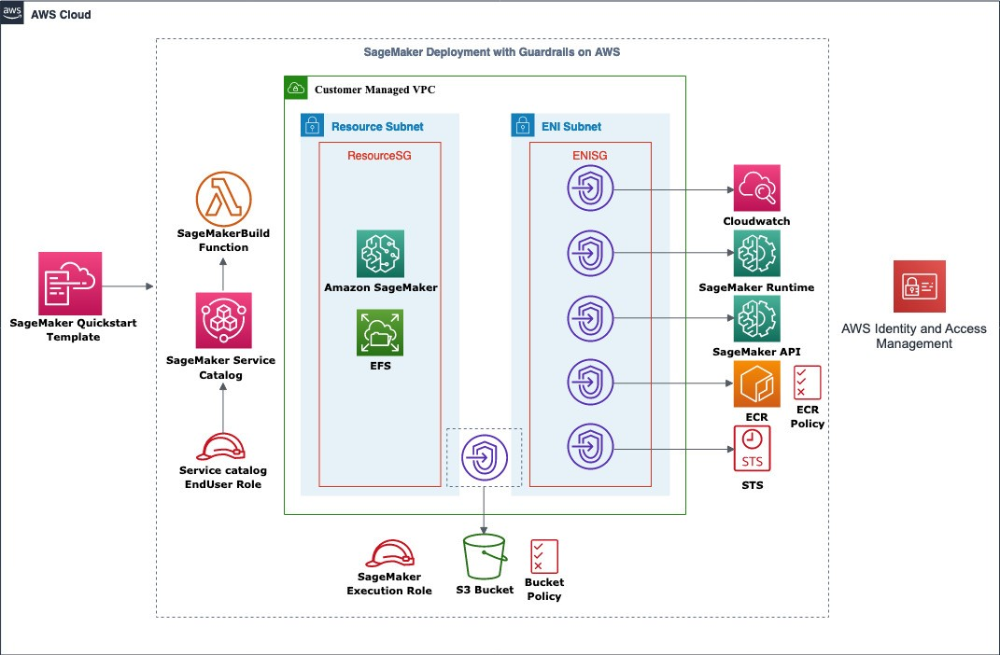

Deploying this Quick Start for a new virtual private cloud (VPC) with
default parameters builds the following {partner-product-short-name} environment in the
AWS Cloud.

[.normal]
// Replace this example diagram with your own. Send us your source PowerPoint file. Be sure to follow our guidelines here : http://(we should include these points on our contributors giude)
:xrefstyle: short
[#architecture1]
.Quick Start architecture for {partner-product-short-name} on AWS

As shown in <<architecture1>>, the Quick Start sets up the following:

* SageMaker Quick Start template is used for provisioning the SageMaker environment
* SageMakerBuild Lambda function for validation of VPC DNS and provisioning of SageMaker resource.
* Service Catalog product for triggering SageMakerBuild function and passing parameter for resource creation.
* Service Catalog enduser role to access and launch SageMaker service catalog product.
* In the private resource subnet:
** Amazon SageMaker for running ML models and workflow.
** Amazon EFS for sharing common modules to all SageMaker notebook.
* In the private Elastic Network Interface subnet we have interface endpoint by which SageMaker will communicate with the following AWS service
** CloudWatch – For real-time monitoring of the SageMaker environment 
** SageMaker runtime - Client applications use this API to get inferences from the models hosted at the specified endpoint.
** SageMaker API - Client applications use this API to get inferences from the models hosted at the specified endpoint.
** Amazon Elastic Container Registry (ECR) with ECR Policy – To store latest ML model images for future deployments
** AWS Security Token Service (AWS STS) – To provide access to an IAM role to perform operations on other AWS services by assuming the role.
* SageMaker execution role for providing access to SageMaker notebook.
* S3 gateway endpoint to access S3 bucket for storing and retrieving ML data and bucket policy for restricting the bucket access.
* Two security groups (ResourceSG & ENISG) and a Route Table according to the AWS best practices, this provides the end user with their own virtual network on AWS.
* An EFS gets created and mounted to the Resource subnet to share the data with SageMaker Notebook.
* In ENI Subnet, Interface VPC endpoints are created for the AWS services like STS, ECR, SageMaker, CloudWatch. It also provides a Gateway VPC Endpoint to provide S3 with access to the Notebook instance.
* Service catalog end user role to access and launch SageMaker Service Catalog.
* Service Catalog launch constraint role to full permission to provision resources.
SageMaker execution role to provide limited access to SageMaker notebook as per tag and tight/appropriate policy to execute operation from notebook

// Add bullet points for any additional components that are included in the deployment. Make sure that the additional components are also represented in the architecture diagram. End each bullet with a period.
The QuickStart will help in provisioning SageMaker with security guardrails which has the following features:

* Private network: Using AWS VPC endpoints, Private API calls from SageMaker to other AWS Services like S3(Gateway), CloudWatch and downloading packages over the internet is restricted.
* Restricting SageMaker access to specific ECR.
* Enforcing mandatory tagging at the user and resource creation level for effective implementation of resource policies and compliance.
* S3 bucket policy restricting access to the specific VPC Endpoint.
* Encryption: Amazon SageMaker ensures that ML model artifacts and other system artifacts are encrypted in transit and at rest. Requests to the Amazon SageMaker API and console are made over a secure (SSL) connection.
* Disabling root access to the notebook instance at the time of launch.
* Identity and Access Management: Each end user may only open, start and stop their own SageMaker Notebook. Restricted IAM roles and policies for SageMaker Execution and Notebook access based on resource tags and Project ID.
