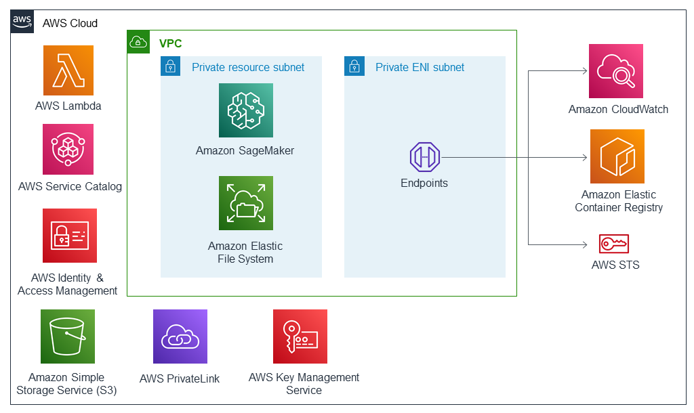

Deploying this Quick Start for a new virtual private cloud (VPC) with
default parameters builds the following {partner-product-short-name} environment in the
AWS Cloud.

[.normal]
// Replace this example diagram with your own. Send us your source PowerPoint file. Be sure to follow our guidelines here : http://(we should include these points on our contributors giude)
:xrefstyle: short
[#architecture1]
.Quick Start architecture for {partner-product-short-name} on AWS

As shown in <<architecture1>>, the Quick Start sets up the following:

* SageMakerBuild Lambda function for validation of VPC Domain Name System (DNS) and provisioning of SageMaker resource.
* AWS Service Catalog for triggering SageMakerBuild function and passing parameters for creating resources.
* Service Catalog end-user role to access and launch Service Catalog.
* In the private resource subnet:
** Amazon SageMaker for running ML models and workflow.
** Amazon Elastic File System (Amazon EFS) for sharing common modules to SageMaker notebooks.
* In the private Elastic Network Interface (ENI) subnet, an interface endpoint through which SageMaker communicates with the following AWS services:
** Amazon CloudWatch for real-time monitoring of the SageMaker environment. 
** SageMaker runtime for client applications to get inferences from models hosted at the specified endpoint.
** SageMaker API for client applications to get inferences from models hosted at the specified endpoint.
** Amazon Elastic Container Registry (Amazon ECR) with ECR Policy for storing the latest ML model images for future deployments.
** AWS Security Token Service (AWS STS) for providing access to an Identity and Access Management (IAM) role to perform operations on other AWS services by assuming the role.
* SageMaker execution role for providing access to the SageMaker notebook.
* Amazon Simple Storage Service (Amazon S3) gateway endpoint to access the S3 bucket for storing and retrieving ML data and bucket policy for restricting bucket access.
* Two security groups (ResourceSG & ENISG) and a route table to provide end users with their own virtual network on AWS.
* Amazon EFS, mounted to the resource subnet to share data with the SageMaker notebook.
* Interface VPC endpoints in the ENI subnet for AWS services, including AWS STS, Amazon ECR, SageMaker, and CloudWatch. It also provides a gateway VPC endpoint to provide S3 with access to the notebook instance.
* Service Catalog launch constraint role to provide full permission to provision resources.
* SageMaker execution role to provide limited access to the SageMaker notebook as per tag and tight/appropriate policy to execute operation from the SageMaker notebook.
* A dedicated S3 bucket used as a data store for training models and SageMaker model artifacts.

// Add bullet points for any additional components that are included in the deployment. Make sure that the additional components are also represented in the architecture diagram. End each bullet with a period.
The QuickStart will help in provisioning SageMaker with security guardrails which has the following features:

* Private network: Using AWS VPC endpoints, Private API calls from SageMaker to other AWS Services like S3(Gateway), CloudWatch and downloading packages over the internet is restricted.
* Restricting SageMaker access to specific ECR.
* Enforcing mandatory tagging at the user and resource creation level for effective implementation of resource policies and compliance.
* S3 bucket policy restricting access to the specific VPC Endpoint.
* Encryption: Amazon SageMaker ensures that ML model artifacts and other system artifacts are encrypted in transit and at rest. Requests to the Amazon SageMaker API and console are made over a secure (SSL) connection.
* Disabling root access to the notebook instance at the time of launch.
* Identity and Access Management: Each end user may only open, start and stop their own SageMaker Notebook. Restricted IAM roles and policies for SageMaker Execution and Notebook access based on resource tags and Project ID.
